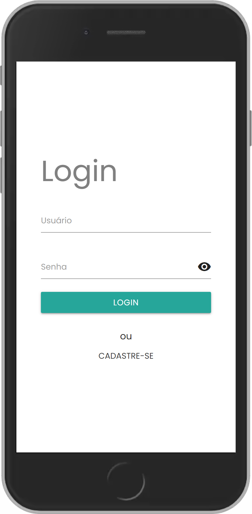
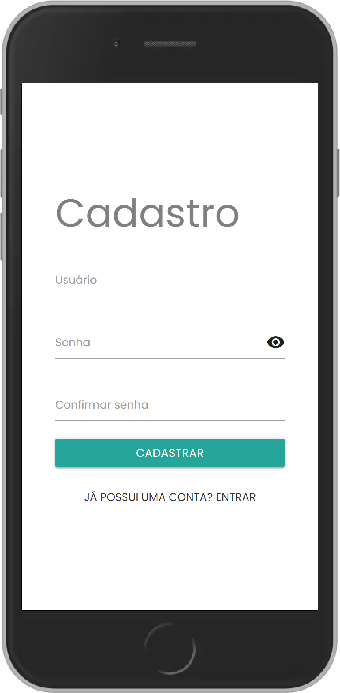
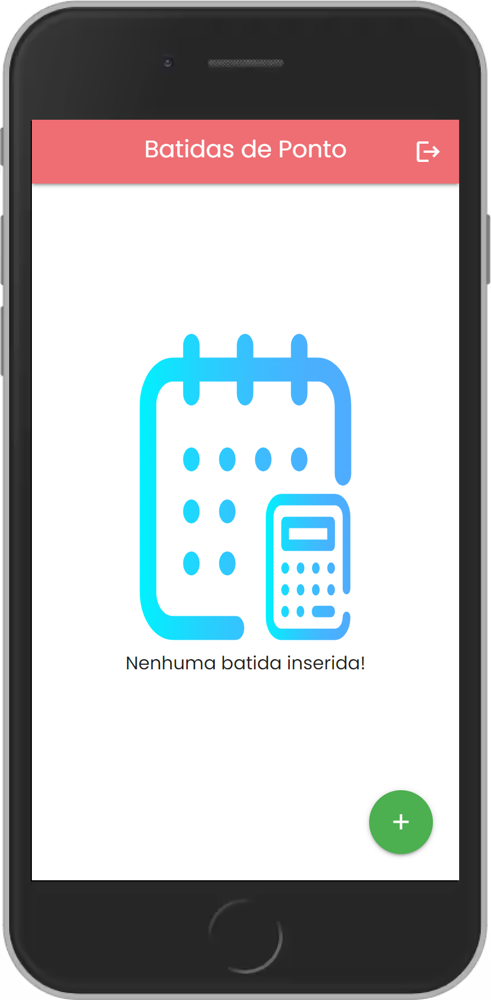
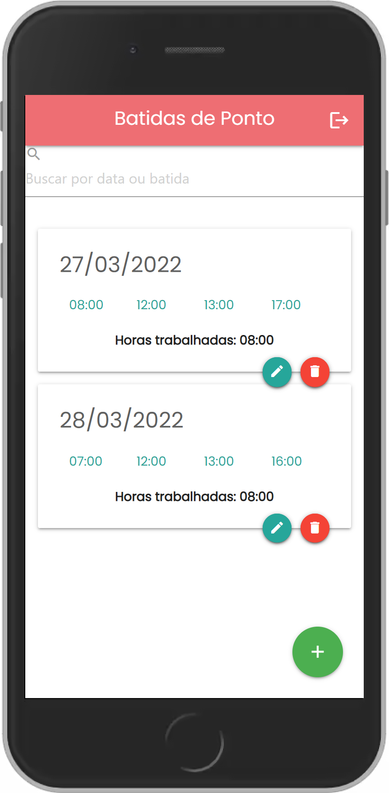

# Projeto TimeSheet Calculator - Luiz Guilherme de Melo Rodrigues
## Projeto TimeSheet Calculator (Calculadora de Folha de Ponto) cujo objetivo é permitir o usuário registrar (adicionar, editar, filtrar e excluir) suas batidas de ponto, bem como mostrar as horas trabalhadas para cada dia.

# Telas

## Tela de Login
    Onde será validado se existe um usuário cadastrado e caso positivo realiza login redirecionando usuário para tela principal.

## Tela de Cadastro
    Onde será validado se existe já existe um usuário cadastrado e caso positivo retorna mensagem informando que usuário já existe.
    Caso o usuário não exista, será realizado a confirmação das duas senhas (campos senha e confirmar senha), criando novo usuário e redirecionando o mesmo para a tela de login.

## Tela Principal Vazia
    Onde será mostrado indicador de que não possui batidas de ponto cadastradas.

## Tela Principal
    Onde será mostrado a tela principal, sendo possível adicionar, editar, filtrar e excluir as batidas de ponto.
    Para adicionar: clicar no botão verde com símbolo de '+'.
    Para editar: clicar no botão de edição do card.
    Para filtrar: digitar algum valor no campo de pesquisa de baixo da navBar.
    Para excluir: clicar no botão de exclusão do card.

# Dados do usuário
    Todos os dados são armazenados no localStorage, sendo possível recarregar/fechar a página e não perder estes dados.
    Os dados armazenados é o vetor de usuários cadastrados no sistema e o usuário que está logado.
    O vetor de usuários cadastrados no sistema, é um objeto com o nome de usuário, senha e batidas de ponto do mesmo.
    Da mesma forma, o usuário que está logado armazena o nome de usuário, senha e batidas de ponto.

# Perguntas e respostas

## A aplicação é original e não uma cópia da aplicação de um colega ou de uma aplicação já existente?
    Sim, a aplicação é original.

## A aplicação tem pelo menos duas interfaces (telas ou páginas) independentes?
    Sim, possui tela de cadastro, tela de login e tela principal, onde é aberto modal e gerenciamento de lista vazia.

## A aplicação armazena e usa de forma relevante dados complexos do usuário?
    Sim, é utilizado os dados para gerenciar os dados de cada usuário e popular a tela principal, além de outras validações no código.

## A aplicação possui um manifesto para instalação no dispositivo do usuário?
    Sim, a aplicação possui um manifesto configurado para a instalação no dispositivo do usuário.

## A aplicação possui um service worker que permite o funcionamento off-line?
    Sim, a aplicação possui um Service Worker que permite o funcionamento off-line.

## O código da minha aplicação possui comentários explicando cada operação?
    Sim, o código da aplicação possui comentários explicando cada método e seu principal objetivo.

## A aplicação está funcionando corretamente?
    Aparentemente tudo ok com a aplicação. Espero funcionar como o esperado. Desenvolvi a aplicação da mesma forma que o professor fez: utilizando o Visual Studio Code com a extensão Live Server para ver o código em tempo real. Criei um repositório no GitHub para a aplicação e integrei no Replit. Algumas funcionalidades as vezes parece dar alguns problemas no Replit (não entendi o motivo disto), por isto digo que aparentemente tudo ok (pelos testes que fiz está ok).

## A aplicação está completa?
    Sim, foi implementado tudo conforme solicitado de acordo com o conhecimento que possuo e o entendimento pessoal que tive do enunciado.
